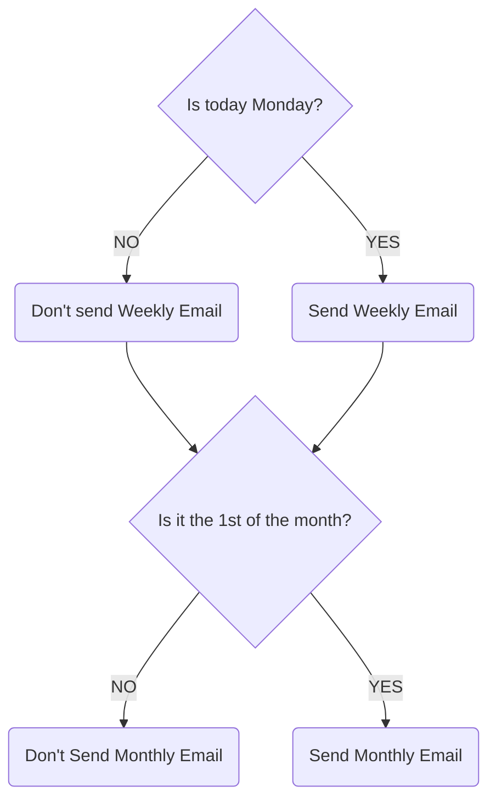
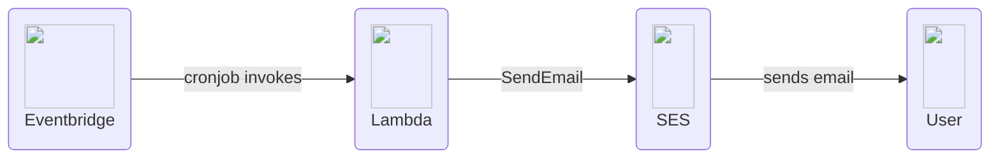
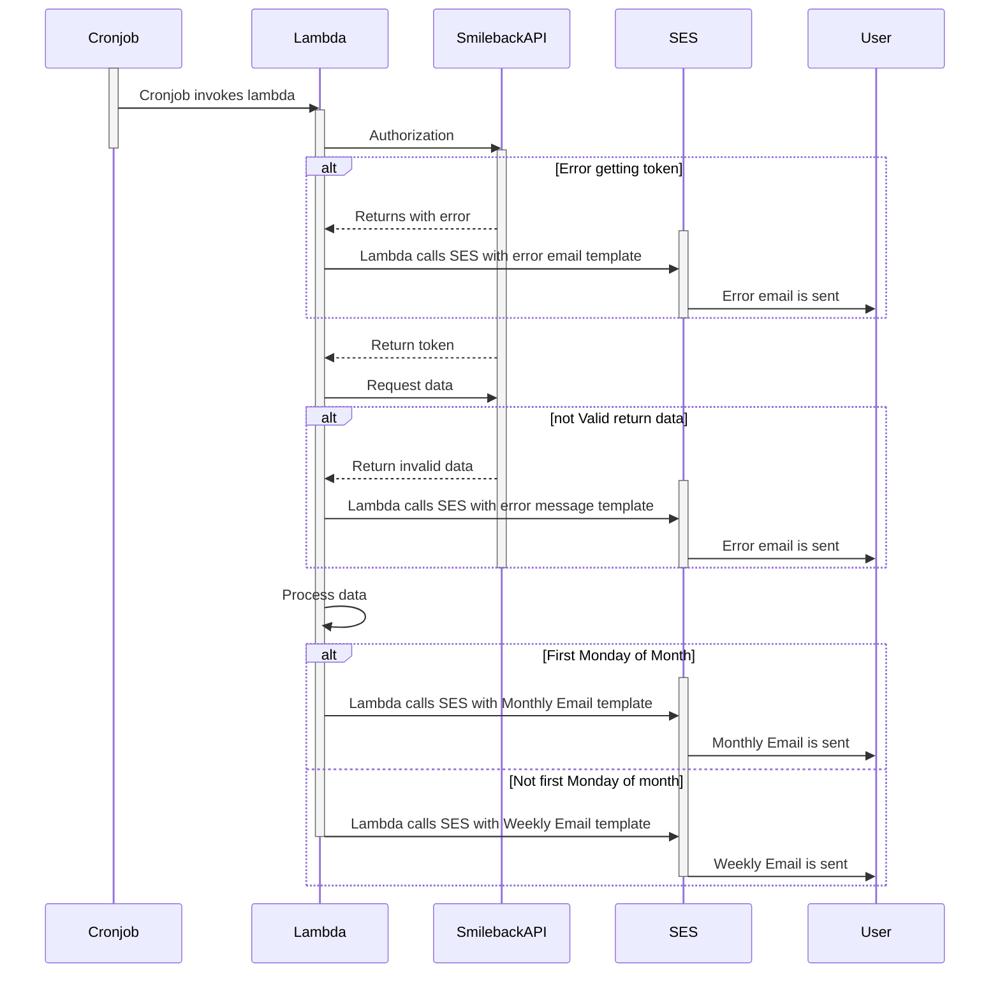

# Email Automation Project

## **Overview** 
Develop a system to automatically generate and send weekly and monthly summary emails to the CFO, detailing the results of Smileback surveys. The goal is to understand and improve Lancom customer experiences by analysing client feedback. 
- **Weekly emails** will provide informative, concise information for the previous week’s *Smileback* data with any urgent feedback.
- **Monthly emails** will provide more in-depth data comparison, showing trends and insights into customer satisfaction over the previous month. 


## **Functionality**

### Scheduling
- **Weekly emails** will be sent out on the **Monday** of every week.
- **Monthly emails** will be sent out on the **1st** of every month. 
- All emails will be scheduled for **7am**.

## Email Sending


> The weekly email **will be sent** when monthly email is sent if it is both a monday and the first of the month. 
### Content - *Weekly Emails*
---
Weekly emails will contain only data gathered from the *week prior*. The contents will be concise and show the following information:

**CSAT Score**
- The Customer Satisfaction (CSAT) Score for the business will be shown for the past week.
- The CSAT Scores for all individuals will be shown for the past week in a table.
- Total number of reviews for both Individuals and Lancom will be shown. 

**Faces**
- Weekly percentage of **Happy Faces**, **Neutral** and **Sad**, faces will be shown for the company.
- Weekly percentage of **Happy Faces**, **Neutral** and **Sad**, faces will be shown for all individual employees. 


**Comments**
- Comments will be included in the email.
    - One comment left from a happy review.
    - One comment left from a neutral review.
    - All comment left from an unhappy review (*if exists*).
> All comments will include the commenter, company and engineer/s associated. 


### Content - *Monthly Emails*
---
Monthly Emails will contain data from the *month prior* to the first of the current month. The contents will still be presented concisely, but will have a wider range of information which includes: 

**CSAT SCORE**
- The company Customer Satisfaction (CSAT) Score will be shown for the past Month.
- CSAT scores will be shown for the company.
- CSAT scores for all staff will be shown. 
- The top three staff CSAT Scores for the previous month will be displayed. Sorted by CSAT score and then total number of reviews. 
- Total reviews will be shown for **individuals** and **Lancom**. 

**Faces**
- **Monthly** percentage of Happy, Neutral, and Unhappy Faces.
- Shown for **all individuals**.
- Shown for **Lancom**. 


**Comments**
- Comments will be included in the email.
    - Two comments will be from happy reviews along with associated people.
    - Two comments will be from neutral reviews along with associated people.
    - All comments will be from unhappy reviews along with associated people and senders.
> This is to understand what the team are doing well and where they can improve. 

## Technical information

- Node.js v20.18.1. 
- AWS Lambda x86_64 architecture, Node.js Runtime.
- Timezone UTC + 13

Setup infrastructe using Sam CLI. 
Smileback API is hit and returns JSON file. Date is checked and then extracted. Data is processed and replaced into the email template after* weekly/monthly* is determined. Lambda invokes SES which sends the email with the contents filled in with Smileback data to the end user (CFO). 

### Smileback API
Smileback API requires an authentication token that is obtained from https://app.smileback.io/api/token. 

The endpoint used is https://app.smileback.io/v3/reviews/?modified_since=<*Date*>

### Token Access
An authentication header is required with an encoded pair. It uses basic encoding. The returned token is an object with ```"token_type"``` and ```"access_token"``` keys. The pair uses a base64 encoded ASCII string.

``` javascript
const encodedPair = btoa(`${smilebackConfig.clientId}:${smilebackConfig.secret}`);
'Authorization', `Basic ${encodedPair}`;
```

The form data requires:
- "grant_type", "password"
- "scope", "read read_recent"
- "username", ```<smileback email>```
- "password", ```<smileback password>```

<br>
The API endpoint takes a date filter which is used to retrieve weekly and monthly data. The date format is ```YYYY-MM-DD```. 

When calling the Smileback API, an authorization header is required with both ```"token_type"``` and ```"access_token"```. 

```javascript
'Authorization',  `${token["token_type"]} ${token["access_token"]}`
```

### AWS Flowchart



### Sequence Diagram



## Deploy Process


1. In terminal. navigate to directory with lambda files 
2. Run terminal command `sam build -- profile <name>`
3. Once the build command has run, run the command `sam deploy --profile <name>`. This will deploy the lambda into the account specified in the profile. If the profile you want to deploy is the default profile, you can run "sam deploy".

> - For deployment, must have `SAM CLI` installed 
> - Don't forget to delete `.env` file from lambda. This has sensitive information.