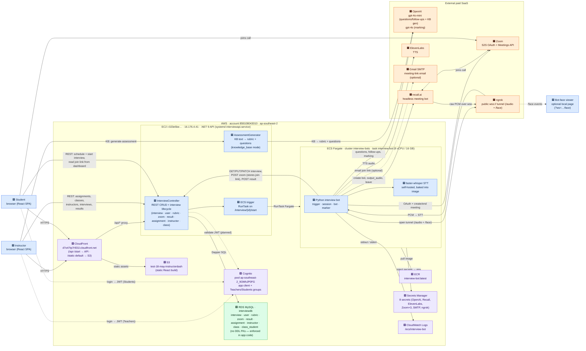

# VivāVoce — Architecture Overview

VivāVoce is an automated AI oral-assessment tool. Instructors create assignments and
schedule interviews; a bot runs each interview over a real Zoom call (speaking and
listening in real time), then marks the transcript against a rubric. This document is the
entry point — it explains how the pieces fit together and links to the detailed docs.

**AWS region for everything:** `ap-southeast-2` (Sydney). **AWS account:** `859108043010`.
All live AWS details in these docs were verified against the running account on 2026-06-12.

---

## The five components

| Component | Lives in | What it is | Detail |
|---|---|---|---|
| Frontend (InstructorDash) | `InstructorDash/` | React web app for instructors and students | [components/frontend.md](components/frontend.md) |
| REST API (InterviewApi) | `backend/InterviewApi/` | ASP.NET Core 9 API; the single gateway to the database and the ECS trigger | [components/backend-api.md](components/backend-api.md) |
| Interview bot | `backend/interview_bot/` | Python bot that runs and marks the interview | [components/interview-bot.md](components/interview-bot.md) |
| Bot-face visualiser | `backend/interview_bot/zoom_integration/face/` | Live animated "face" page showing bot state | [components/bot-face.md](components/bot-face.md) |
| MySQL database | AWS RDS `interviewdb` | Shared data store (accessed only through the API) | [components/database.md](components/database.md) |

The live AWS resource inventory (verified) is in
[components/aws-infrastructure.md](components/aws-infrastructure.md). A UML use case diagram of
who does what (instructor, student, and the bot as a system actor) is in
[diagrams/USE_CASE_DIAGRAM.md](diagrams/USE_CASE_DIAGRAM.md).

## How a request flows

This is the full system map (the static topology — what calls what). The standalone copy,
condensed variants, and a service-by-service inventory are in
[diagrams/SYSTEM_MAP.md](diagrams/SYSTEM_MAP.md).

Legend — 🟦 our code · 🟩 our DB · 🟪 AWS managed · 🟧 external paid SaaS.
Solid arrow = live call (labelled with purpose). Dashed = auth / optional / "runs".

### One interview, end to end

1. **Instructor creates an assignment** in the React dashboard → `POST /api/assignment`.
2. **An interview is scheduled** → the dashboard POSTs a rubric, a placeholder zoom row, then
   the interview (`POST /api/rubric`, `/api/zoom`, `/api/interview`).
3. **The interview is triggered** → `POST /api/interview/{id}/start`. The .NET API calls
   `ecs:RunTask` to launch the bot container on Fargate with `INTERVIEW_ID={id}` and returns
   immediately (`{status: "starting"}`).
4. **The container boots** (`zoom_integration/trigger.py`): it fetches the interview from the
   API, creates a Zoom meeting, and writes the join link back to the API (so it shows on the
   student dashboard) and to the logs. It optionally emails the student the link, then waits for
   the start time.
5. **The interview runs** (`zoom_integration/session.py`): a recall.ai bot joins the Zoom call;
   the bot speaks via ElevenLabs TTS and listens via faster-whisper STT; `bot.py` drives the
   question/follow-up state machine using OpenAI; the [bot-face](components/bot-face.md) page can
   watch live.
6. **It finishes**: the transcript and final status are written back via the API; the Zoom
   meeting ends.
7. **Marking** (`marker.py`): the transcript + rubric go to OpenAI; a suggested grade and report
   are written back as a `result` row for the instructor to review at `/report/:id`.

A fuller, narrated version of this flow (with the exact endpoints and status transitions) is in
[components/backend-api.md](components/backend-api.md) and the per-phase flowchart in
[diagrams/INTERVIEW_BOT_FLOWCHART.md](diagrams/INTERVIEW_BOT_FLOWCHART.md).

## Build & run

The build instructions are split into three guides under [build/](build/):

1. [Access the deployed build](build/1-access-deployed.md) — the live site URL, accounts, and
   what to be aware of. Start here if you just want to use the running system.
2. [Build & run locally](build/2-build-run-local.md) — run each component on your own machine
   from a cold clone.
3. [Build & deploy to AWS](build/3-build-deploy-production.md) — push new versions of each
   component to the live deployment.

## Other references

- [reference/secrets.md](reference/secrets.md) — every secret, its local `.env` name, its AWS
  Secrets Manager name, and where it is consumed.
- [reference/known-issues.md](reference/known-issues.md) — the risk register.
- [diagrams/SYSTEM_MAP.md](diagrams/SYSTEM_MAP.md) — service topology diagram and inventory.
- [diagrams/USE_CASE_DIAGRAM.md](diagrams/USE_CASE_DIAGRAM.md) — UML use case diagram.
- [diagrams/DATABASE_ERD.md](diagrams/DATABASE_ERD.md) — database entity relationship diagram.
- [diagrams/INTERVIEW_BOT_CLASS_DIAGRAM.md](diagrams/INTERVIEW_BOT_CLASS_DIAGRAM.md) — UML class
  diagram of the bot's modules and classes.
- [diagrams/](diagrams/) — rendered flowcharts and the system map.
- [costing/COSTING.md](costing/COSTING.md) — the per-interview cost model.
