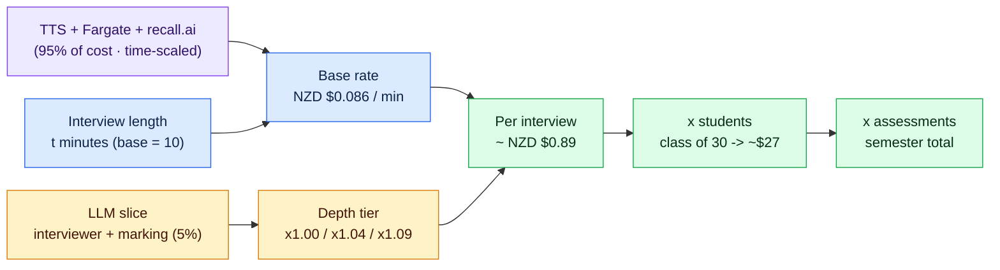
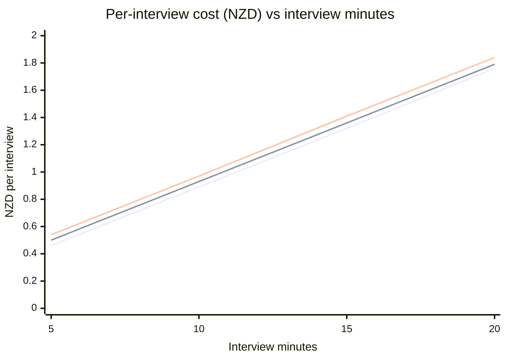

# Cost model — per interview & per marking (NZD)

A rough, defensible unit-cost estimate for the AI oral-assessment system, built for the
project presentation. **Interview time is the base driver**; a **depth-of-thinking
multiplier** (interviewer `max_tokens` per call + marker model) scales it. Pairs with
`../diagrams/SYSTEM_MAP.md` (what calls what) and `../diagrams/INTERVIEW_BOT_FLOWCHART.md` (the sequence).

> All figures are **estimates from public list prices**, converted at **USD→NZD = 1.71**
> (spot, 11 Jun 2026). Every number is an editable input in `interview_cost_model.xlsx` —
> change the FX rate or any unit price and the totals re-compute. Treat ±25% as the honest
> confidence band; the **ElevenLabs $/char** assumption is the single biggest swing factor (see §9).
>
> **Verified 2026-06-12:** Fargate Sydney rates via the AWS Pricing API; OpenAI / recall.ai /
> ElevenLabs against current public pricing; marking token usage **measured with a live
> gpt-4o call** (5,998 in / 442 out on a full 10-minute transcript + rubric).

---

## 1. Headline (the slide number)

```
cost_per_interview ≈ BaseRatePerMinute × minutes × DepthMultiplier
```

| Quantity | Value |
|---|---|
| **Base rate** | **NZD $0.089 / interview-minute** (≈ 9 cents/min, incl. marking at the 10-min baseline) |
| **Depth multiplier** | **×1.00** (current) → **×1.04** (standard) → **×1.09** (deep) |
| **Default 10-min interview** | **≈ NZD $0.89** (current depth) |
| **Per marking (alone)** | **≈ NZD $0.03** (gpt-4o, measured) → up to **$0.10** (reasoning model) |

So a typical interview **+ its automated marking costs roughly NZD $0.90**. The dominant
cost is **giving the bot a voice** (ElevenLabs text-to-speech) plus the **compute and
live-meeting plumbing** (Fargate + recall.ai) — the LLM "brain" is a rounding error. See §4–§5.

---

## 2. Pricing assumptions (all editable)

| Item | Assumed unit price (USD) | Note |
|---|---|---|
| USD → NZD | × **1.71** | Spot 11 Jun 2026; update as needed |
| **ElevenLabs** Turbo v2.5 | ~**$0.00011 / character** | ⚠️ biggest swing factor; 0.5 credit/char, Creator $22/100k credits |
| OpenAI **gpt-4o** | $2.50 / 1M input · $10.00 / 1M output | Marker (default; grandfathered price, confirmed 2026) |
| OpenAI **gpt-4o-mini** | $0.15 / 1M input · $0.60 / 1M output | Interviewer questions/follow-ups (confirmed 2026) |
| OpenAI **reasoning** (o-series, deep tier) | ~$2.00 / 1M in · ~$8.00 / 1M out | Deep-tier marker only |
| **recall.ai** bot | **$0.50 / recording-hour** (≈ $0.0083 / min) | 2026 pay-as-you-go price (dropped from $0.70); prorated per second |
| **AWS Fargate** (Sydney, x86) | $0.04856 / vCPU-hr + $0.00532 / GB-hr | Verified via AWS Pricing API. Task is **8 vCPU / 16 GB** (rev :7) |
| **faster-whisper** `base.en` | **$0** API | Runs locally on the Fargate CPU |
| **Zoom / ngrok / EC2 API / RDS** | flat monthly | Fixed overhead — see §6, *not* in unit cost |

---

## 3. What actually happens per interview (grounded in the code)

| Driver | Value | Source |
|---|---|---|
| Interview length (base) | `duration_minutes: 10` | `backend/interview_bot/interview_config.json` |
| Questions / follow-ups | 5 questions · `follow_up_depth` ≤ 2 · 30 s each | same |
| Interviewer LLM | `gpt-4o-mini`, `max_tokens: 120`, temp 0.7 | `prompts.py:174` |
| Marker LLM | `gpt-4o`, no token cap, temp 0.2, JSON — **measured 5,998 in / 442 out** | `marker.py:31,140`; live call 2026-06-12 |
| LLM calls / interview | ~8 prefetch + ~5 follow-ups live + 1 marking ≈ **13–14 billable** | `bot.py`, `session.py` |
| TTS spoken text | ElevenLabs `eleven_turbo_v2_5`, ~**2,850 chars** | `audio.py:75` |
| STT | faster-whisper `base.en`, local int8 (free API) | `audio.py:90` |
| Compute | ECS Fargate **8 vCPU / 16 GB** (rev :7, sized for live transcription), one task/interview, ~13 min wall | `task_definition.json:5-6` |

---

## 4. Component build-up — baseline (10 min, current depth ×1)

| Component | Scales with | ~USD | ~NZD | Share |
|---|---|---:|---:|---:|
| **ElevenLabs TTS** (~2,850 chars) | **time** | 0.314 | **0.536** | **60%** |
| Fargate 8 vCPU / 16 GB (~13 min) | time | 0.103 | **0.175** | 20% |
| recall.ai bot (10 min @ $0.50/hr) | time | 0.083 | **0.142** | 16% |
| OpenAI marking (gpt-4o, measured ~6k in / 0.45k out) | depth | 0.020 | **0.033** | 4% |
| OpenAI interviewer (gpt-4o-mini, ~13 calls @120 tok) | time + depth | 0.004 | **0.007** | 1% |
| faster-whisper STT (local) | — | 0.000 | 0.000 | 0% |
| **Total per interview** | | **0.523** | **≈ 0.89** | 100% |

**Base rate** = time-variable slice ÷ 10 min ≈ **NZD $0.086 / interview-minute**. Marking
(~NZD $0.03) is the only non-time-scaled piece, folded into the baseline.

---

## 5. Depth-of-thinking multiplier

"Depth" = how much the bot is allowed to *think per call*: the interviewer's `max_tokens`
and the marker model. It only touches the **LLM slice** (interviewer + marking ≈ 5% of
cost), so even a large depth increase barely moves the total — that's the key insight.

| Tier | Interviewer `max_tokens` | Marker model | LLM-slice multiplier | **Total / interview (NZD)** | Total multiplier |
|---|---|---|---:|---:|---:|
| **1 — Shallow** (current) | 120 | gpt-4o | ×1.0 | **$0.89** | ×1.00 |
| **2 — Standard** | ~300 | gpt-4o (longer output) | ×1.9 | **$0.93** | ×1.04 |
| **3 — Deep** | ~800 | reasoning (o-series) | ×3.0 | **$0.97** | ×1.09 |

> Reading: making the bot "think 3× harder" adds **~8 cents** to a 90-cent interview.
> The cost levers are **interview length** and **how much the bot talks (TTS)** — not
> thinking depth.

---

## 6. Scaling example

One assessment for a **class of 30 students** = 30 interviews + 30 markings:

| Scope | Interviews | Current-depth (NZD) | Deep-depth (NZD) |
|---|---:|---:|---:|
| 1 student, 1 assessment | 1 | $0.89 | $0.97 |
| 1 class (30), 1 assessment | 30 | **$27** | $29 |
| 1 class (30), 2 assessments / sem | 60 | **$54** | $58 |
| 5 classes (150), 2 assessments | 300 | **$268** | $292 |

**Fixed monthly overhead** (EC2 API, RDS MySQL, CloudFront/S3, ngrok, Zoom license)
sits *on top* — order ~NZD $80–150/month regardless of volume — so per-interview overhead
**shrinks as usage grows** (e.g. ~$2/interview at 60/mo, ~$0.40/interview at 300/mo).

---

## 7. Cost model — diagram



## 8. Cost vs interview length, by depth tier



> The three depth lines sit almost on top of each other — visual proof that **time (and
> talk volume), not thinking depth, drives cost**. The slope ≈ the base rate of ~8 cents/min.

---

## 9. Caveats

- **ElevenLabs $/char is the highest-leverage input.** At $0.00011/char (Turbo 0.5
  credit/char on Creator's $22/100k credits) it's 60% of unit cost; higher tiers are
  cheaper per credit. Verify against a real invoice before quoting externally — and note a
  self-hosted TTS would gut this 60%.
- recall.ai ($0.50/recording-hour, 2026 pay-as-you-go) and Fargate prices are
  list/pay-as-you-go; committed-use or a self-hosted bot would cut the next 36%. The
  Fargate slice doubled when the task was resized to 8 vCPU / 16 GB for live transcription
  — dropping `LIVE_TRANSCRIBE` and reverting to a smaller task would claw back ~NZD $0.09.
- Token counts and spoken-character counts are modelled averages; actual usage varies with
  transcript length, rubric size, and how chatty the interviewer is.
- Fixed overhead is excluded from the unit cost on purpose — fold it in via §6 if you need
  a fully-loaded figure for a given monthly volume.

> **Export:** paste either ```mermaid``` block into <https://mermaid.live> →
> Actions → PNG/SVG for a slide. The xlsx (`docs/costing/interview_cost_model.xlsx`) lets you
> tweak any assumption live during the talk.
