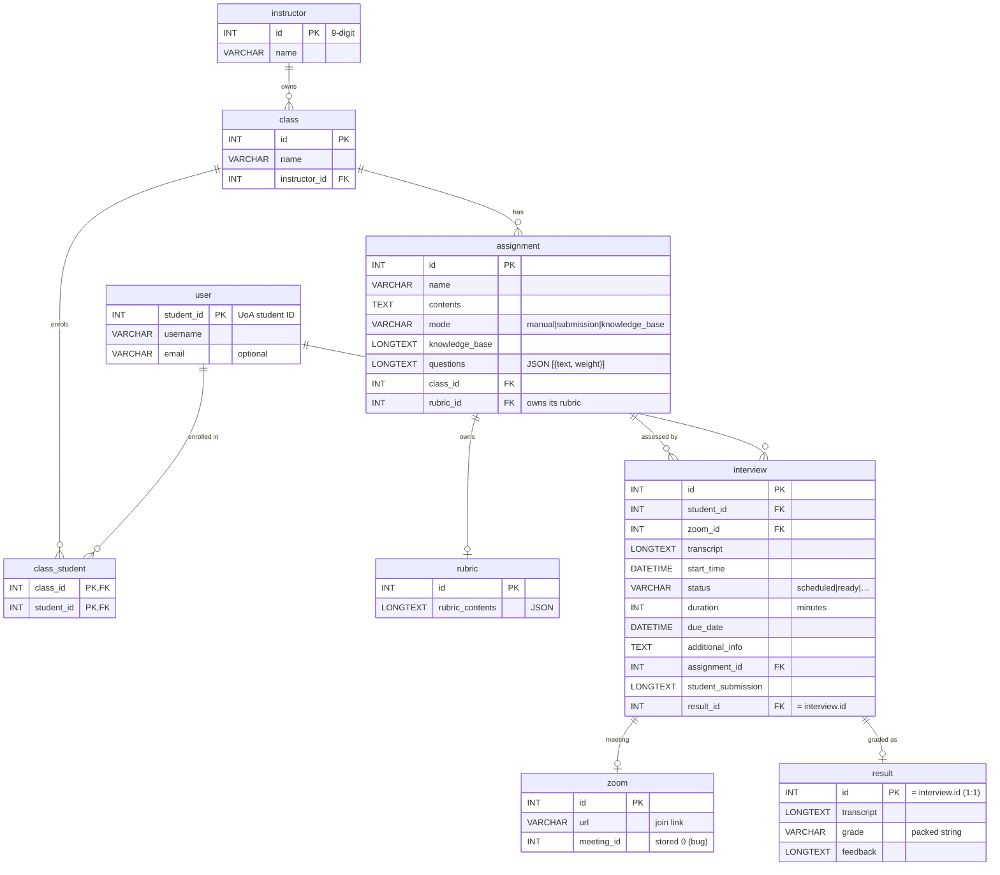

# Database — entity relationship diagram

The `interviewDb` MySQL schema (RDS, MySQL 8.4). Canonical DDL:
`backend/InterviewApi/Data/sql/000_local_full_schema.sql` plus the numbered migrations in the
same folder. Full column notes are in [../components/database.md](../components/database.md).

> **Note:** the schema defines **no DDL foreign keys** — every relationship below is enforced in
> application code (the .NET API and the bot), matching the project convention. Cardinalities
> show intent, not constraints. `result.id == interview.id` once an interview is marked
> (migration 003), and rubrics are owned by the **assignment**, not the interview.
>
> Other column notes that don't fit the boxes: `user.student_id` is the UoA student ID (not
> auto-increment); `user.email` is optional (only smooths headless runs); `instructor.id` is the
> 9-digit ID entered at account creation; `zoom.meeting_id` is an INT too small for real Zoom
> meeting IDs, so the bot stores `0` (known bug); `result.grade` is a packed string like
> `Criterion: 8/10 | … || TOTAL: 42/50`.

> **Export:** rendered PNG committed alongside (`database_erd-1.png`). Regenerate with:
> `npx -p @mermaid-js/mermaid-cli mmdc -i DATABASE_ERD.md -o database_erd.png -w 2000 -s 4 -b transparent`
