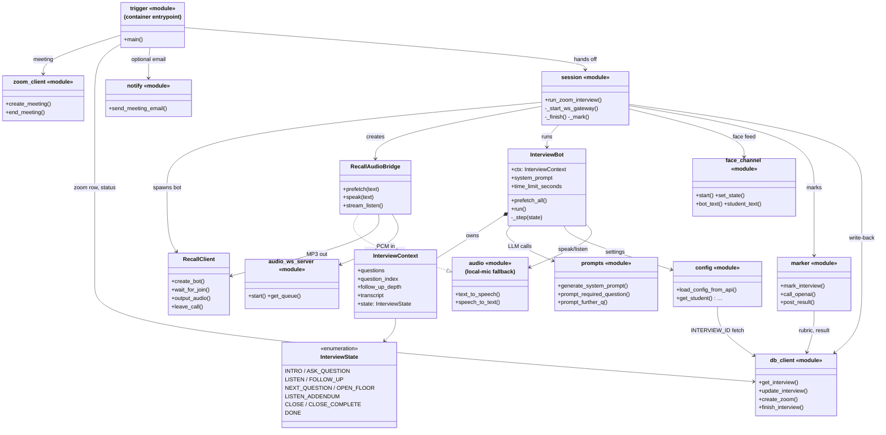

# UML class diagram — interview bot

Structure of `backend/interview_bot/`. The bot is mostly **function-based modules** (shown with
the `«module»` stereotype, listing their key public functions) around five real classes:
`InterviewBot`, `InterviewContext`, `InterviewState`, `RecallAudioBridge`, and `RecallClient`.
The prose walkthrough of each module (and the full function lists) is in
[../components/interview-bot.md](../components/interview-bot.md).

- **`trigger` → `session` → `InterviewBot`** is the production call chain inside the ECS
  container; `main.py` (not shown) is the local headless entrypoint that runs `InterviewBot`
  directly with the `audio` module.
- The dashed realisation from `RecallAudioBridge` to `audio` represents the runtime
  monkey-patch: `session.py` replaces `audio.text_to_speech` / `speech_to_text` with bridge
  methods so the same `InterviewBot` code works over Zoom or a local microphone.

> **Export:** rendered PNG committed alongside (`interview_bot_class_diagram-1.png`). Regenerate with:
> `npx -p @mermaid-js/mermaid-cli mmdc -i INTERVIEW_BOT_CLASS_DIAGRAM.md -o interview_bot_class_diagram.png -w 2000 -s 4 -b transparent`
