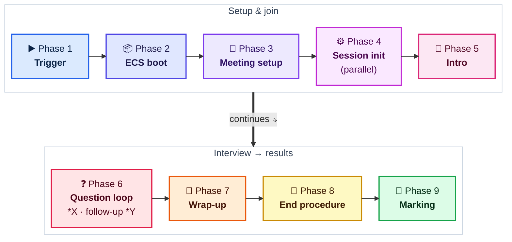
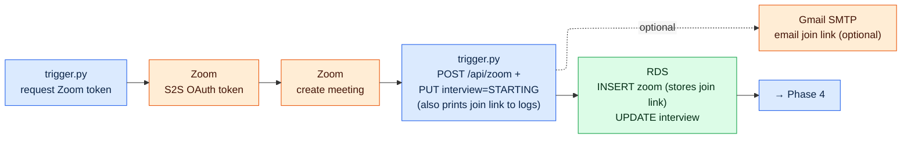
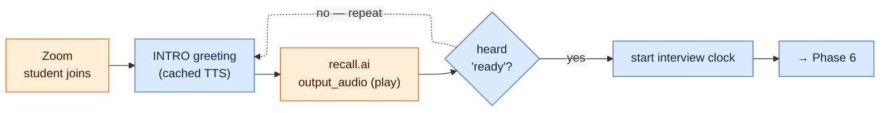
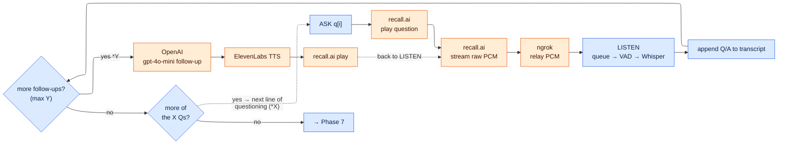
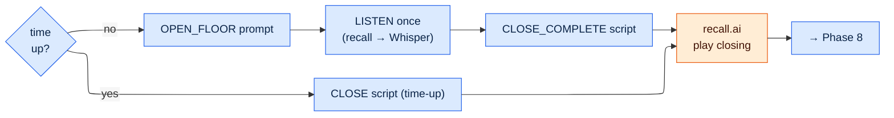
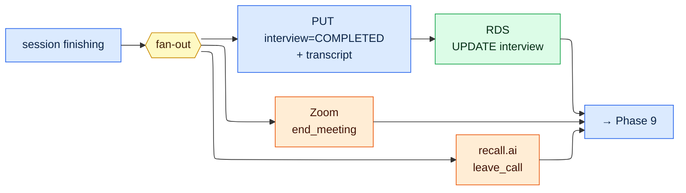

# Interview Bot — End-to-End Flowchart (per-phase, left-to-right)

One interview, traced from the frontend "start" click through to marking.
Worked example: **5 lines of questioning**, **follow-up depth = 2**.

**Presentation note:** each phase below is its **own standalone diagram that flows
strictly left → right**, sized for **one phase per slide**. Concurrency is shown as
**parallel horizontal branches** (a fork splits into two rows that both run rightward
and rejoin) — so anything stacked vertically *within a phase* is running at the same time.

Legend (by box colour) — blue = our code · green = our DB (via the .NET API) ·
purple = AWS infra · orange = external paid API. Dashed edges = loop-backs.

---

## Overview rail



---

## Phase 1 — Trigger (synchronous; returns immediately)

```mermaid
%%{init: {"themeVariables": {"fontFamily": "arial"}, "flowchart": {"defaultRenderer": "elk", "rankSpacing": 28, "nodeSpacing": 22, "padding": 12, "htmlLabels": false}}}%%
flowchart LR
    classDef ours fill:#dbeafe,stroke:#2563eb,color:#0b2447;
    classDef db   fill:#dcfce7,stroke:#16a34a,color:#052e16;
    classDef ext  fill:#ffedd5,stroke:#ea580c,color:#431407;

    FE1["Frontend<br/>POST /api/interview/&#123;id&#125;/start"]:::ours
    A2[".NET API<br/>load interview row"]:::ours
    D2["RDS<br/>SELECT interview"]:::db
    A3[".NET API<br/>ecs.RunTask Fargate<br/>(override INTERVIEW_ID)"]:::ours
    ACK["return &#123;status:starting&#125;<br/>to frontend"]:::ours
    NEXT["→ Phase 2<br/>(task starts async)"]:::ours

    FE1 --> A2
    A2 --> D2
    A2 --> A3
    A3 --> ACK
    A3 -. "async (out-of-band)" .-> NEXT
```



---

## Phase 2 — ECS task boot

```mermaid
%%{init: {"themeVariables": {"fontFamily": "arial"}, "flowchart": {"defaultRenderer": "elk", "rankSpacing": 28, "nodeSpacing": 22, "padding": 12, "htmlLabels": false}}}%%
flowchart LR
    classDef ours  fill:#dbeafe,stroke:#2563eb,color:#0b2447;
    classDef db    fill:#dcfce7,stroke:#16a34a,color:#052e16;
    classDef infra fill:#ede9fe,stroke:#7c3aed,color:#2e1065;

    C4["ECS pulls image<br/>ECR interview-bot:latest"]:::infra
    C5["inject 8 secrets<br/>(Secrets Manager → env)"]:::infra
    C6["start container<br/>python trigger.py"]:::infra
    T6["config.py<br/>GET /api/interview/&#123;id&#125;"]:::ours
    D6["RDS<br/>SELECT InterviewDetail<br/>(interview+user+rubric+zoom+assignment)"]:::db
    SEC["OPENAI · RECALL · ELEVENLABS<br/>ZOOM×3 · SMTP · NGROK"]:::infra
    NOTE["merge over interview_config.json<br/>(LLM / audio / question defaults)"]:::ours
    NEXT["→ Phase 3"]:::ours

    C4 --> C5 --> C6 --> T6
    C5 --> SEC
    T6 --> D6
    T6 --> NOTE
    D6 --> NEXT
```



---

## Phase 3 — Meeting setup & notification



> The join link is **always** written to the DB (`POST /api/zoom`) so the student
> dashboard can show it, and it is printed to the bot's logs. The SMTP email is an
> optional convenience (mostly for headless runs) — a valid student email is not required.

---

## Phase 4 — Session init  (PARALLEL)

```mermaid
%%{init: {"themeVariables": {"fontFamily": "arial"}, "flowchart": {"defaultRenderer": "elk", "rankSpacing": 28, "nodeSpacing": 22, "padding": 12, "htmlLabels": false}}}%%
flowchart LR
    classDef ours fill:#dbeafe,stroke:#2563eb,color:#0b2447;
    classDef db   fill:#dcfce7,stroke:#16a34a,color:#052e16;
    classDef ext  fill:#ffedd5,stroke:#ea580c,color:#431407;
    classDef gate fill:#fef9c3,stroke:#ca8a04,color:#422006;

    S11["PUT interview=RUNNING"]:::ours
    S12["start audio_ws :8766"]:::ours
    S13["open ngrok tunnel"]:::ours
    N13["ngrok<br/>public wss:// URL"]:::ext
    S14["recall create_bot<br/>join Zoom · audio_separate_raw→wss"]:::ours
    FORK{{"fork"}}:::gate

    TA["Track A — recall.ai<br/>poll until in_call_recording"]:::ext
    TB1["Track B — OpenAI<br/>gpt-4o-mini: X questions"]:::ext
    TB2["Track B — ElevenLabs<br/>TTS prefetch (Qs + closings)"]:::ext

    JOIN{{"join (both done)"}}:::gate
    NEXT["→ Phase 5"]:::ours

    S11 --> S12 --> S13 --> N13 --> S14 --> FORK
    FORK --> TA --> JOIN
    FORK --> TB1 --> TB2 --> JOIN
    JOIN --> NEXT
```



---

## Phase 5 — Student joins · intro



---

## Phase 6 — Question loop  ×5  ·  follow-up loop ×2



---

## Phase 7 — Wrap-up



---

## Phase 8 — End procedure  (PARALLEL teardown)



---

## Phase 9 — Marking

```mermaid
%%{init: {"themeVariables": {"fontFamily": "arial"}, "flowchart": {"defaultRenderer": "elk", "rankSpacing": 28, "nodeSpacing": 22, "padding": 12, "htmlLabels": false}}}%%
flowchart LR
    classDef ours fill:#dbeafe,stroke:#2563eb,color:#0b2447;
    classDef db   fill:#dcfce7,stroke:#16a34a,color:#052e16;
    classDef ext  fill:#ffedd5,stroke:#ea580c,color:#431407;

    MK["marker.py<br/>GET interview + rubric"]:::ours
    D30["RDS<br/>SELECT interview, rubric"]:::db
    O31["OpenAI<br/>gpt-4o structured grading"]:::ext
    MP["POST /api/result"]:::ours
    D32["RDS<br/>INSERT result"]:::db
    FE33["Frontend /report/&#123;id&#125;<br/>GET interview + result"]:::ours

    MK --> O31 --> MP --> FE33
    MK --> D30
    MP --> D32
```



> Note — as in `../ARCHITECTURE.md`: in the live ECS path **Phase 9 (marking) is not
> auto-invoked** by `session.py` — it runs in the local CLI flow or must be
> triggered separately. The chart shows the intended complete flow.

---

To export per-slide images, render the whole file at high resolution with a transparent
background:

```
npx -p @mermaid-js/mermaid-cli mmdc -i INTERVIEW_BOT_FLOWCHART.md -o phase.png -w 2000 -s 4 -b transparent
```

This produces `phase-1.png` … `phase-10.png` (overview rail + nine phases), one per diagram.
