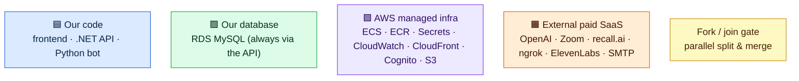

# Diagram Legend

Shared key for `INTERVIEW_BOT_FLOWCHART.md` and `SYSTEM_MAP.md`.

> Note: this file intentionally keeps HTML labels **on** (no `htmlLabels:false`) so the
> coloured-square emoji render in colour. If you export it to PNG and the boxes clip,
> raise `padding` in the init line.

---

## Box colours — what each section is



---

## Arrows & connectors — what each line means

```mermaid
%%{init: {"themeVariables": {"fontFamily": "arial"}, "flowchart": {"padding": 12, "nodeSpacing": 25, "rankSpacing": 35}}}%%
flowchart LR
    classDef plain fill:#ffffff,stroke:#94a3b8,color:#0f172a;
    classDef gate  fill:#fef9c3,stroke:#ca8a04,color:#422006;

    S1["A"]:::plain -->|"solid — live call / main flow"| S2["B"]:::plain
    S2 ~~~ D1["A"]:::plain
    D1 -. "dashed — async, loop-back, or auth / planned" .-> D2["B"]:::plain
    D2 ~~~ B1["A"]:::plain
    B1 <-->|"double — two-way link (e.g. recall.ai ↔ Zoom)"| B2["B"]:::plain
    B2 ~~~ F1{{"fork"}}:::gate
    F1 -->|"split into / merge from parallel branches"| F2{{"join"}}:::gate
```



---

### Export

```
npx -p @mermaid-js/mermaid-cli mmdc -i LEGEND.md -o legend.png -w 1600 -s 4 -b transparent
```

Produces `legend-1.png` (colours) and `legend-2.png` (arrows).
