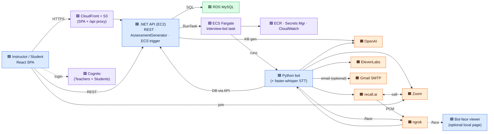
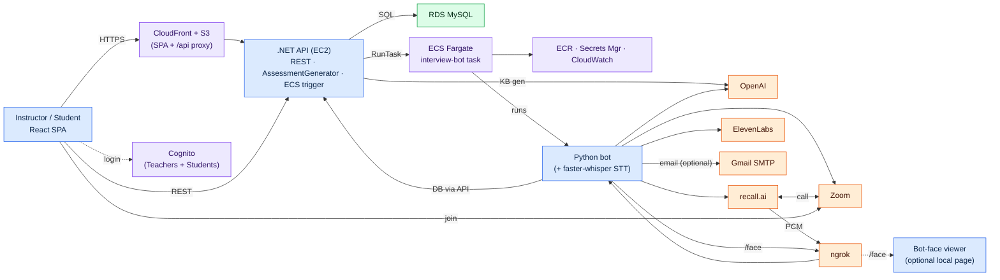
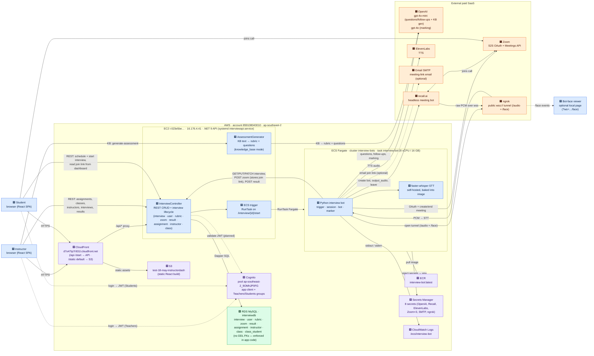

# System Map — all services & the calls between them

A single non-temporal overview of every service in the project and what calls what.
Pairs with `INTERVIEW_BOT_FLOWCHART.md` (which shows the *sequence* of one interview);
this map shows the *static topology*.

---

## Condensed (one-page) version

Same topology, collapsed to ~15 boxes: the API's facets merged into one node, the
AWS plumbing (ECR + Secrets Manager + CloudWatch) folded into a single box, subgraph
containers dropped, and labels trimmed. Colour still carries the grouping.



If it's still slightly wide for a portrait page, change the first line to
`flowchart TB` (taller/narrower) or add
`%%{init: {"flowchart": {"defaultRenderer": "elk"}}}%%` above it for tighter packing.

---

## Condensed — emoji-free

Identical nodes and links to the condensed map above, with the emoji removed so it
renders cleanly with `htmlLabels: false` (and in any monochrome-emoji renderer). The
box **colour** still encodes the type — blue = our code, green = our DB, purple = AWS
managed, orange = external paid SaaS.



---

## Full-detail version

Legend — 🟦 our code · 🟩 our DB · 🟪 AWS managed · 🟧 external paid SaaS.
Solid arrow = live call (labelled with purpose). Dashed = auth / optional / "runs".



---

## Service inventory

| Service | Type | Role | Talks to |
|---|---|---|---|
| Instructor / Student browser | 🟦 React SPA | Dashboards (create assignments/classes, schedule & start interviews, view gradebook, read the Zoom join link) | CloudFront, Cognito, .NET API |
| Bot-face viewer | 🟦 our code (local page) | Optional live visualiser of bot state/lines over the bot's `/face` WebSocket | ngrok (bot's tunnel) |
| CloudFront `d7o47tp7r931l…` | 🟪 AWS | CDN: serves the SPA (S3 origin) and proxies `/api/*` and `/start/*` to the API; `/static/*` + default → S3 | S3, .NET API |
| S3 `test-18-may-instructordash` | 🟪 AWS | Static hosting of the built React app | — |
| Cognito pool `…_9OMhJP0FG` | 🟪 AWS | Auth; `Teachers` + `Students` groups. **Tokens not yet enforced by the API.** | Browsers, (planned) API |
| .NET 9 API (EC2 `16.176.4.41`) | 🟦 ours | REST CRUD + interview lifecycle; **AssessmentGenerator** (KB→rubric+questions); ECS `RunTask` trigger | RDS, OpenAI, ECS, Cognito (planned) |
| RDS MySQL `interviewdb` | 🟩 ours | System of record (interview, user, rubric, zoom, result, assignment, instructor, class, class_student) | .NET API only |
| ECS Fargate `interview-bots` | 🟪 AWS | Runs one `interview-bot` task (8 vCPU / 16 GB) per interview | ECR, Secrets Manager, CloudWatch |
| ECR `interview-bot` | 🟪 AWS | Docker image registry | ECS |
| Secrets Manager (8) | 🟪 AWS | Injects API keys into the task at launch | ECS |
| CloudWatch Logs | 🟪 AWS | Task stdout/stderr, 365-day retention | — |
| Python interview bot | 🟦 ours | Orchestrates the meeting: Zoom, recall.ai, TTS/STT, LLM, marking; all DB I/O via the API | .NET API, Zoom, recall.ai, ngrok, ElevenLabs, OpenAI, SMTP |
| faster-whisper | 🟦 self-hosted | STT, in-process inside the container (no external call) | — |
| OpenAI | 🟧 paid | `gpt-4o-mini` live questions/follow-ups **and** KB assessment generation; `gpt-4o` marking | .NET API (AssessmentGenerator) + bot |
| Zoom | 🟧 paid | S2S OAuth, create/end meeting; hosts the live call | bot, recall.ai, student |
| recall.ai | 🟧 paid | Headless bot that joins Zoom, plays our TTS, streams participant PCM back | bot, ngrok, Zoom |
| ngrok | 🟧 paid | Public `wss://` tunnel (one gateway, routed `/audio` + `/face`) so recall.ai and the face viewer can reach the in-container socket | bot, recall.ai, face viewer |
| ElevenLabs | 🟧 paid | Text-to-speech for the interviewer voice | bot |
| Gmail SMTP | 🟧 paid | Optionally emails the Zoom join link to the student (the link is also stored in the DB and printed to logs) | bot |

## Notes for the reader
- **OpenAI is called from two places:** the **.NET API** (`AssessmentGenerator`, for knowledge-base assignments — it turns instructor KB text into a weighted rubric + areas-of-focus questions) and the **bot** (live question phrasing, follow-ups, and marking). A dev-CLI twin of the generator lives at `backend/interview_bot/kb_generator.py` and must be kept prompt-identical.
- **All database access funnels through the .NET API** — neither the browser nor the bot opens MySQL directly.
- **The join link is always served to the frontend.** The bot writes the Zoom URL to the DB via `POST /api/zoom`, so the student dashboard can show it, and it is also printed to the bot's logs (`[trigger] Join URL: …`). The **SMTP email is optional** — mainly a convenience for headless runs; a valid student email is not required for the interview to work.
- **The bot-face viewer is optional.** It's a local static page that subscribes to the bot's `/face` WebSocket (same ngrok tunnel as the audio stream) to show live bot state/lines — see `../components/bot-face.md`.
- **The frontend currently calls the API two ways:** through CloudFront's `/api/*` behaviour *and* directly at `http://16.176.4.41:5000` (hardcoded in the components). The direct path is a cleanup item.
- **Auth is provisioned but not enforced:** users authenticate against Cognito (`Teachers` / `Students` groups) and instructors have a parallel `instructor` DB row, but the API does not yet validate JWTs — it trusts `instructor_id`/`student_id` supplied in the request.

> **Export:** rendered PNGs committed alongside (`system_map-1.png` … `system_map-3.png`, one per
> ```mermaid``` block in order). Regenerate with:
> `npx -p @mermaid-js/mermaid-cli mmdc -i SYSTEM_MAP.md -o system_map.png -w 2000 -s 4 -b transparent`
