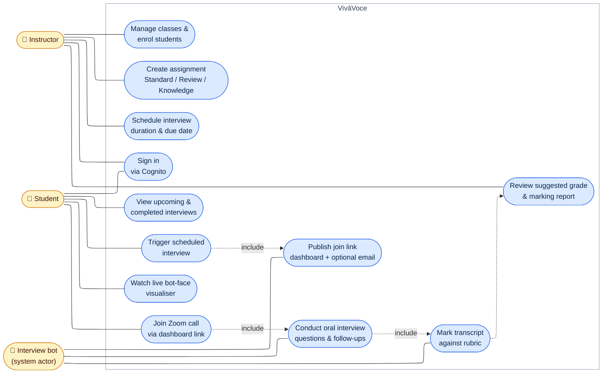

# UML use case diagram

Who does what with VivāVoce. Mermaid has no native use-case diagram type, so this uses the
standard convention: actors as side nodes, use cases as ovals (stadium nodes) inside the system
boundary, `---` for association, dashed arrows for `«include»`. The narrative version of each
flow is in [../ARCHITECTURE.md](../ARCHITECTURE.md).

- The **interview bot** is modelled as a secondary (system) actor: it is launched by the system
  when a student triggers an interview, then drives the Zoom call, marking, and join-link
  publication itself.
- `Sign in` is shared: both roles authenticate against the same Cognito pool; the group
  (Teachers/Students) selects the dashboard.
- The join link always reaches the student dashboard; emailing it is optional.

> **Export:** rendered PNG committed alongside (`use_case_diagram-1.png`). Regenerate with:
> `npx -p @mermaid-js/mermaid-cli mmdc -i USE_CASE_DIAGRAM.md -o use_case_diagram.png -w 2000 -s 4 -b transparent`
