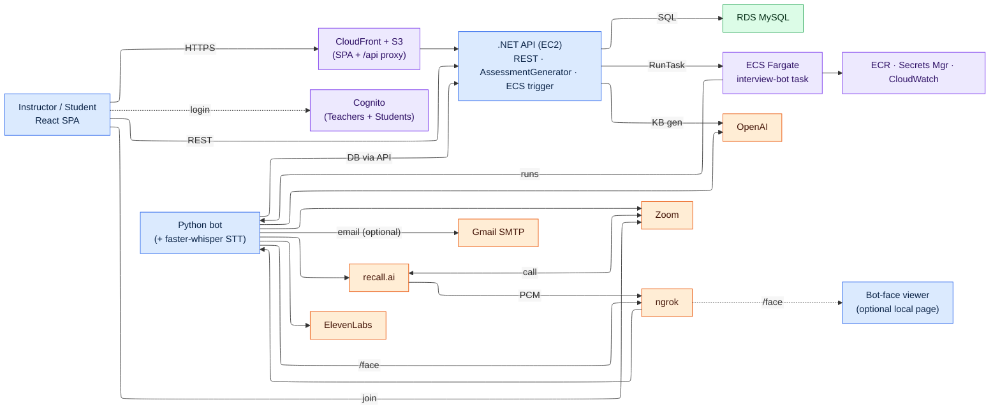

```mermaid
%%{init: {"themeVariables": {"fontFamily": "arial"}, "flowchart": {"defaultRenderer": "elk", "rankSpacing": 28, "nodeSpacing": 22, "padding": 12, "htmlLabels": false}}}%%
flowchart LR
    classDef ours fill:#dbeafe,stroke:#2563eb,color:#0b2447;
    classDef db   fill:#dcfce7,stroke:#16a34a,color:#052e16;
    classDef aws  fill:#ede9fe,stroke:#7c3aed,color:#2e1065;
    classDef ext  fill:#ffedd5,stroke:#ea580c,color:#431407;

    CLIENT["Instructor / Student<br/>React SPA"]:::ours
    CF["CloudFront + S3<br/>(SPA + /api proxy)"]:::aws
    COG["Cognito<br/>(Teachers + Students)"]:::aws
    API[".NET API (EC2)<br/>REST · AssessmentGenerator · ECS trigger"]:::ours
    DB["RDS MySQL"]:::db
    ECS["ECS Fargate<br/>interview-bot task"]:::aws
    INFRA["ECR · Secrets Mgr · CloudWatch"]:::aws
    BOT["Python bot<br/>(+ faster-whisper STT)"]:::ours
    FACE["Bot-face viewer<br/>(optional local page)"]:::ours
    AI["OpenAI"]:::ext
    ZOOM["Zoom"]:::ext
    RECALL["recall.ai"]:::ext
    NGROK["ngrok"]:::ext
    EL["ElevenLabs"]:::ext
    SMTP["Gmail SMTP"]:::ext

    CLIENT -->|HTTPS| CF --> API
    CLIENT -->|REST| API
    CLIENT -. login .-> COG
    API -->|SQL| DB
    API -->|KB gen| AI
    API -->|RunTask| ECS
    ECS --> INFRA
    ECS -->|runs| BOT
    BOT -->|DB via API| API
    BOT --> AI
    BOT --> ZOOM
    BOT --> RECALL
    BOT --> EL
    BOT -->|"email (optional)"| SMTP
    RECALL -->|PCM| NGROK --> BOT
    BOT -->|/face| NGROK
    NGROK -. "/face" .-> FACE
    RECALL <-->|call| ZOOM
    CLIENT -->|join| ZOOM
```
